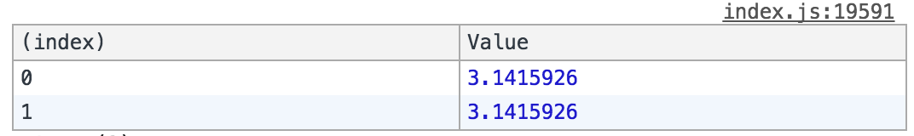
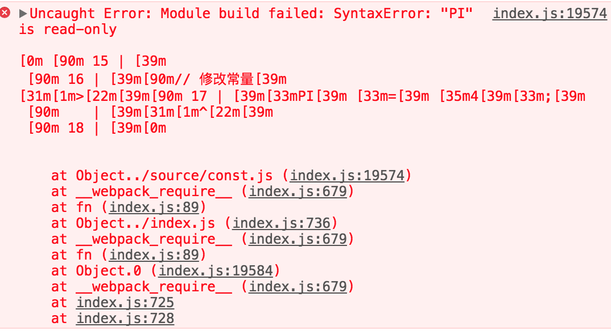
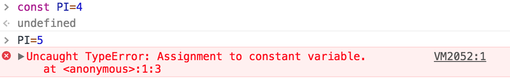

## 常量


在ES3中JavaScript中是不支持常量语法的，在ES5中需要借助 defineProperty 来设置常量，而在 ES6 中可以简单的设置一个变量为常量。

```javascript
// ES6 设置常量的语法
const PI = 3.1415926;
```

<hr>

```javascript
// ES5 中设置常量的语法
Object.defineProperty(typeof global === "object" ? global : window, "PI2", {
    value:        3.1415926,
    enumerable:   true,
    writable:     false,
    configurable: false
});
```

大家可以运行下结果，<code>console.table([PI, window.PI2]);</code>



*注意事项*

常量是不能被修改的，如果修改则会触发错误。

1. 如果使用 webpack 构建工具，则编译抛出错误，如图所示：



2. 如果在浏览器直接修改同样会抛出错误，如图所示：



但是下面情况是可以被改变的，如：

```javascript
const obj={
  a:1,
  b:2
}
//修改对象的值是可行的
obj.a=3;
// 修改对象是不可行的
obj={
  c:1
};
```

知道为什么吗？因为对象是引用类型，const 指向的是对象引用地址，只要地址不变就符合 const 定义。
