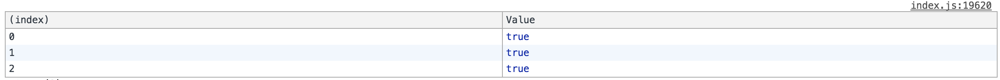

## 作用域

### 变量

>JavaScript 有两个范围：全局和局部。  在函数定义之外声明的变量是全局变量，它的值可在整个程序中访问和修改。  在函数定义内声明的变量是局部变量。  每当执行函数时，都会创建和销毁该变量，且无法通过函数之外的任何代码访问该变量。  JavaScript 不支持块范围（通过一组大括号 {. . .} 定义新范围），但块范围变量的特殊情况除外。

这是ES5的时候MDN对JavaScript作用域的诠释。其实在ES6中增加了块作用域{...}，于此对应的两个支持块范围的变量 let 和 const。const上一小节讲过了，我们这小节重点讲 let 并区分 let 和 var 。

```javascript
let callbacks = [];
for (let i = 0; i <= 2; i++) {
    callbacks[i] = function () { return i * 2; };
}

console.table([
  callbacks[0]() === 0,
  callbacks[1]() === 2,
  callbacks[2]() === 4
])
```

运行结果如下：




```javascript
var callbacks2=[]
for (var i = 0; i <= 2; i++) {
    callbacks2[i] = function () { return i * 2; };
}

console.table([
  callbacks2[0]() === 0,
  callbacks2[1]() === 2,
  callbacks2[2]() === 4
])
```

运行结果如下：


只所以产生这样的区别，就是 let 是块作用域变量，每次循环的时候循环体就是一个块作用域，let 让变量重新绑定到块作用域。如果不理解我们说的再通俗一些：

先说 let 声明的变量是块作用域，在上面的代码中 let 声明了两个变量，一个 callbacks ,一个是 i 。callbacks 的块作用域范围是当前的执行块，因为不是在函数内声明的所以他是全局的执行块，注意这里的 callbacks 是不能通过 window 对象访问的。i 是在 for 里声明的，i 的作用域是循环体的 {} 作用域。每执行一次循环体 i 都会重新绑定到 {} 的作用域内从而达到了“隔离”的效果。

再说 var 声明的变量是没有块作用域的，因为不在函数内所以是全局作用域，而且 var 声明的变量是要提升的，而 let 声明的变量不会。上述代码中 var 声明的变量有 callbacks2 和 i 。由于变量提升，i 其实和 callbacks 都是全局作用域是可以通过 window 对象访问的。所以闭包的函数中 i 都指向了全局作用域的 i 。

### 块作用域

有时候你想在一块隔离区域执行代码，因为上面我们知道变量的作用域原因，在 ES6 特意增加了块作用域符号 {} 。

```js
  {
    function foo () { return 1 }
    foo() === 1
    {
        function foo () { return 2 }
        foo() === 2
    }
    foo() === 1
  }
```

ES6 的 {} 可以隔离一块作用域出来，大家可以尽情的用。那么在 ES5 及 ES3 该如何用呢？看下面代码：

```js
  (function () {
      var foo = function () { return 1; }
      foo() === 1;
      (function () {
          var foo = function () { return 2; }
          foo() === 2;
      })();
      foo() === 1;
  })();
```

### 参考资料

- [MDN 作用域](https://msdn.microsoft.com/zh-cn/library/bzt2dkta(v=vs.94).aspx)
- [深入浅出ES6（十四）：let和const](http://www.infoq.com/cn/articles/es6-in-depth-let-and-const)
